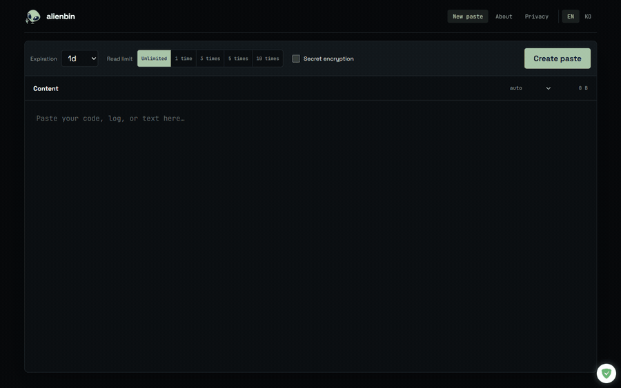

# Alienbin

<!-- Hero: 11s demo GIF. Flow: type code, pick expiry + read limit, create, open the confirmation screen, reveal with syntax highlighting. -->
<p align="center">
  
</p>

<p align="center">
  <a href="https://github.com/Blue-B/Alienbin/actions/workflows/ci.yml"></a>
  <a href="https://alienbin.foliyo.workers.dev"></a>
</p>

**Expiring pastebin with client-side encryption.** Share code, logs, and config through a link that deletes itself on time or read limits. No account, no tracking, runs on the Cloudflare Workers free tier.

[Live demo](https://alienbin.foliyo.workers.dev) · [한국어](README.ko.md) · [Security policy](SECURITY.md)

<!-- Keep this file short: details belong in docs/. -->

## Features

- **Per-paste expiry** (30s to 7d) enforced in every query, independent of cleanup jobs
- **Read limits** (1/3/5/10) consumed atomically; concurrent opens cannot exceed the count
- **Secret mode**: AES-GCM encryption in the browser. The key lives in the URL fragment and never reaches the server
- **Developer editor**: syntax highlighting, line numbers, TAB indentation, KO/EN UI, CLI client
- **Hardened by default**: strict CSP, prepared statements only, rate limiting, Turnstile
- **Zero fixed cost**: one Worker + D1, nothing to maintain

> v1 shipped a collection-wide TTL bug, published as [CVE-2026-31827](https://github.com/Blue-B/Alienbin/security/advisories/GHSA-hqvr-6v89-gwff). v2 was rebuilt around that lesson: [docs/legacy-analysis.md](docs/legacy-analysis.md)

## Usage

Web: paste text, pick expiry and read limit, share the link. Secret links carry the decryption key in the fragment.

CLI (same wire format as the web app):

```bash
cat error.log | alienbin --expire 1h
alienbin app.py --secret --once --expire 10m
# → https://<host>/p/<id>#k=<secret>
```

## Development

```bash
npm install
cp .dev.vars.example .dev.vars   # Turnstile official test keys
npm run dev                      # local D1 migration + wrangler dev
npm test                         # 29 tests: unit, integration, security, concurrency
npm run deploy
```

## Documentation

| Doc | Contents |
|---|---|
| [Architecture](docs/architecture.md) | system diagram, module layout, data flow |
| [Security design](docs/security-design.md) | threat model, mitigations, remaining risks |
| [Operations](docs/operations.md) | free-tier limits, cost structure, runbook |
| [Migration](docs/migration.md) | why legacy data was not migrated |
| [ADRs](docs/adr/) | five decision records, incl. deferring file uploads |
| [Legacy analysis](docs/legacy-analysis.md) | v1 post-mortem and the CVE root cause |
