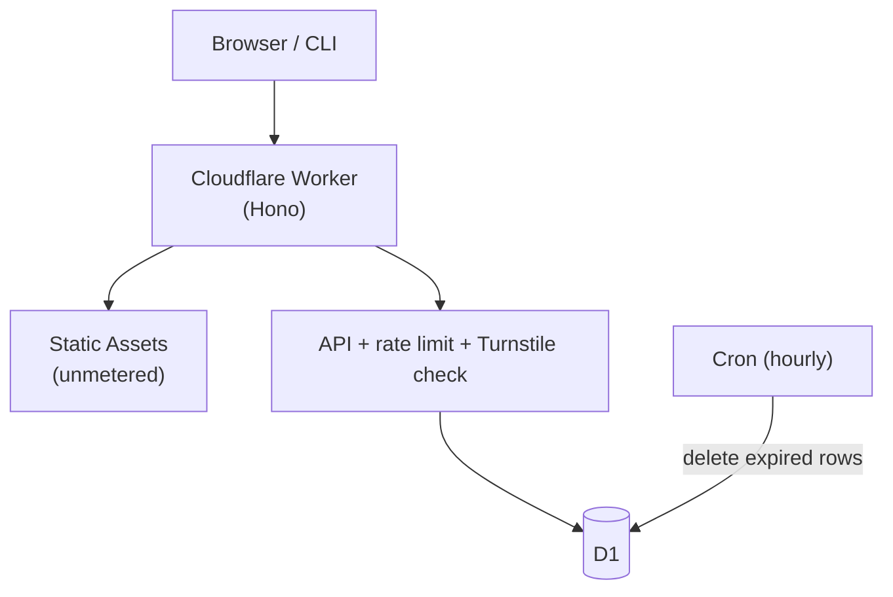

# Alienbin

**Secure ephemeral text sharing for developers.**

> Share code, logs, and config with per-paste expiration, optional client-side encryption,
> and atomic read limits. Runs within Cloudflare's free tier with no server to maintain.

[Live demo](https://alienbin.foliyo.workers.dev) | [About](https://alienbin.foliyo.workers.dev/about) | [Security model](https://alienbin.foliyo.workers.dev/security)

## Why Alienbin v2 exists

Alienbin v1 was a live pastebin service, and running it surfaced three structural
problems:

1. **A real security defect.** v1 recreated a collection-wide MongoDB TTL index according to
   each request's expiration option. Because MongoDB TTL indexes apply to the whole
   collection, one user choosing "30 seconds" could shorten every other user's paste. This
   was published as [CVE-2026-31827 / GHSA-hqvr-6v89-gwff](https://github.com/Blue-B/Alienbin/security/advisories/GHSA-hqvr-6v89-gwff)
   (high severity). Hiding it would be dishonest; instead it became the centerpiece of the
   redesign. See [TTL isolation](#ttl-isolation-and-cve-fix).
2. **Ongoing server cost with no revenue.** An always-on host plus a database cluster cost
   money every month while serving temporary text.
3. **No safety net.** No tests, no CI, CSP explicitly disabled, no rate limiting.

v2 is a rewrite that fixes all three *in code you can audit*: the CVE fix is a regression
test, the cost model is documented against official quotas, and the security properties are
covered by a dedicated test suite.

Full analysis of v1: [docs/legacy-analysis.md](docs/legacy-analysis.md).

## What changed from v1

| | v1 | v2 |
|---|---|---|
| Backend | Express (Node process) | Cloudflare Workers + Hono |
| Frontend | EJS templates | Static frontend (Vite + vanilla TS) |
| Database | MongoDB Atlas | Cloudflare D1 |
| Hosting | External Node platform | Serverless (Workers Static Assets) |
| Expiration | Mongo TTL index mutation (collection-wide) | Per-record `expires_at` |
| CSP | Explicitly disabled (`contentSecurityPolicy: false`) | Strict CSP, no `unsafe-inline` |
| Paste IDs | Mongo ObjectId in URLs | Random ~128-bit base64url IDs |
| Secrets | Plaintext only | Optional AES-256-GCM client-side encryption |
| Read limits | not available | Atomic 1, 3, 5, or 10-read consumption |
| Tests | none (`no test specified`) | Regression + security suite (vitest) |
| CI | none | GitHub Actions (lint/typecheck/test/build) |
| Security policy | none | [SECURITY.md](SECURITY.md) |

## Architecture



Details: [docs/architecture.md](docs/architecture.md). Design decisions:
[docs/adr/](docs/adr/)

## Security model

- **Expiration is enforced by query semantics**, not by background jobs: every read filters
  `expires_at > now`. The hourly cron only reclaims storage.
- **Strict headers everywhere**: CSP without `unsafe-inline`, `no-store` on all dynamic
  responses, `nosniff`, `X-Robots-Tag: noindex`, `Referrer-Policy: no-referrer`.
- **Rate limiting**: native Workers rate limiting binding (10 writes/min/client), `429` +
  `Retry-After`; raw IPs are not written to D1 or application logs.
- **Turnstile** on web creates as an additional bot-friction layer; the API itself relies on
  rate limiting since the CLI is public.
- Threat-by-threat analysis with residual risks: [docs/security-design.md](docs/security-design.md)

## Client-side encryption

Secret pastes are encrypted **in your browser** before anything leaves it:

1. A fresh 256-bit key is generated locally; content is AES-GCM encrypted
   (`v1.<iv>.<ciphertext>` format, protocol-bound via AAD).
2. The server receives ciphertext plus `SHA-256(key)` as an access proof, never plaintext
   and never the key.
3. The key travels only in the URL fragment: `https://…/p/<id>#k=<key>`. Fragments are not
   sent to servers, so the Worker physically cannot decrypt what it stores.

Lose the fragment and the paste is unrecoverable by design.

## Read limits

Read-limited pastes support 1, 3, 5, or 10 successful opens. A one-time paste uses a single
`DELETE ... RETURNING`, so concurrent readers race on one row and exactly one receives the
content. Higher limits use `UPDATE ... WHERE read_count < max_reads RETURNING`, which allows
exactly the configured number of successful consumes under concurrency. GET requests never
consume a limited paste, so crawlers and link previews cannot spend a read.
Rationale: [ADR-004](docs/adr/adr-004-burn-after-read-atomic-consume.md).

## TTL isolation and CVE fix

The v1 implementation recreated a collection-wide MongoDB TTL index according to each
request's expiration option. Because MongoDB TTL indexes apply at the collection level, one
user's expiration choice could affect other stored documents, published as
[CVE-2026-31827](https://github.com/Blue-B/Alienbin/security/advisories/GHSA-hqvr-6v89-gwff).

Alienbin v2 removes collection-level TTL mutation entirely and stores `expires_at` on each
paste. Every read path enforces expiry independently of any cron job, and a regression test
proves that a 7-day paste outlives a concurrent 30-second paste. Active rows are removed by
an hourly cleanup job; D1 Time Travel may retain recoverable history for up to 7 days on the
Free plan. See
[ADR-002](docs/adr/adr-002-per-record-expires-at.md) and the release checklist in
[docs/security-release-checklist.md](docs/security-release-checklist.md).

## Zero-fixed-cost architecture

Static assets are unmetered on Cloudflare; only dynamic API calls count against the free
100k/day quota, and D1's free tier covers far more reads/writes than this service plausibly
needs. At currently expected traffic Alienbin runs with **$0 fixed cost**. This is not a
promise of free operation at every traffic level. Numbers and sources:
[docs/operations.md](docs/operations.md).

## Tech stack

TypeScript (strict), Hono, Cloudflare Workers, D1, Cron Triggers, Turnstile,
Vite, vanilla TypeScript, highlight.js, Vitest, `@cloudflare/vitest-pool-workers`, and Biome

## Local development

```bash
npm install
cp .dev.vars.example .dev.vars   # Turnstile 공식 테스트 키 포함
npm run dev                      # local D1 migration + wrangler dev
```

## Tests

```bash
npm test          # unit + integration + security suites (miniflare D1)
```

Covered: TTL isolation regression, expired lookup, cron deletion, invalid TTL/payload/ID,
XSS payload handling, SQL-injection resistance, encryption round-trip & wrong-key failure,
access proof enforcement, burn-after-read single consumption, concurrent consume race,
rate limiting, raw endpoint MIME/policy, security header presence.

## Deployment

```bash
wrangler d1 create alienbin       # database_id를 wrangler.jsonc에 반영
npm run db:migrate:remote
wrangler secret put TURNSTILE_SECRET_KEY
npm run deploy                    # https://alienbin.<subdomain>.workers.dev
```

A custom domain is optional. The service is fully functional on `workers.dev`.

## Public information pages

The deployed site publishes its operational claims instead of leaving them only in the
repository:

- [About](https://alienbin.foliyo.workers.dev/about)
- [Privacy notice](https://alienbin.foliyo.workers.dev/privacy)
- [Terms of use](https://alienbin.foliyo.workers.dev/terms)
- [Security model](https://alienbin.foliyo.workers.dev/security)

## CLI

Zero-dependency Node CLI (same wire format as the web app):

```bash
cat error.log | alienbin --expire 1h
alienbin app.py --secret --once --expire 10m
# → https://<host>/p/<id>#k=<secret>
```

Host override via `ALIENBIN_BASE_URL`. Local testing: `npm run build && npm link`.

## Security

See [SECURITY.md](SECURITY.md) for reporting policy. Please do not open public issues with
exploit details.

## Legacy v1

v1 is preserved under the `v1-legacy` tag. It is end-of-life and should not be deployed;
see [docs/migration.md](docs/migration.md) for why legacy data was intentionally not
migrated (ephemeral by design).
