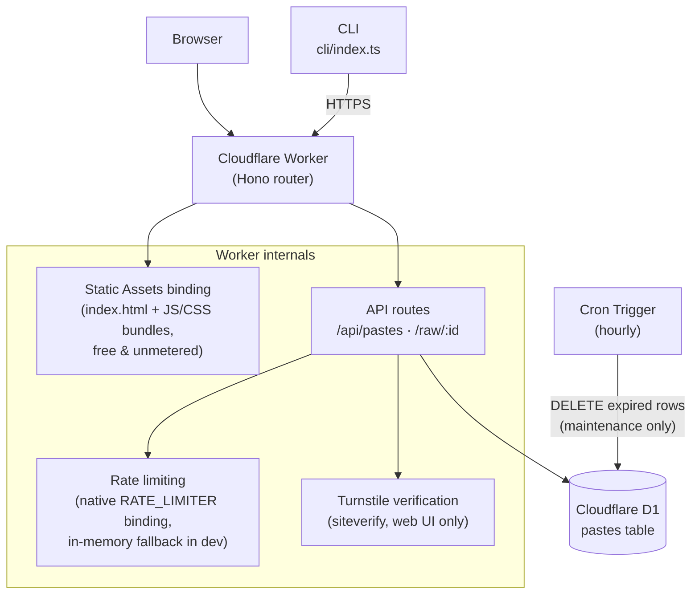
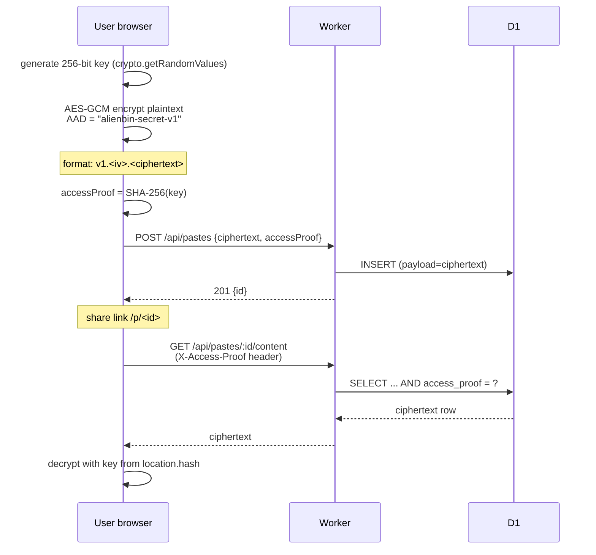

# Architecture

Alienbin v2 runs entirely on Cloudflare's free tier: one Worker serving both the static
frontend (Static Assets) and the JSON API, backed by D1 (SQLite). There is no VM, no
container, no external database service.

## System overview



Key property: **static asset requests never invoke the Worker**, so they are free and do not
count against the Workers daily request quota. Only `/api/*` and `/raw/*` are routed to the
Worker first (`run_worker_first` in `wrangler.jsonc`).

## Module layout

```text
src/
├─ worker/            # Cloudflare Worker (Hono)
│  ├─ routes/         # health, paste endpoints
│  ├─ services/       # domain logic: paste-service, rate-limit, turnstile
│  ├─ repositories/   # D1 access, prepared statements only
│  ├─ middleware/     # security headers, rate limiting
│  ├─ validation/     # request validation (whitelists, byte-size checks)
│  └─ types/env.ts    # bindings + AppError
├─ web/               # Vite frontend, vanilla TypeScript
├─ shared/            # constants/types/expiration/clock shared by both sides
└─ cli/               # zero-dependency Node CLI
migrations/           # D1 SQL migrations
tests/                # unit / integration / security (vitest + workers pool)
```

## Secret paste flow (client-side encryption)

The server never sees plaintext **or** the encryption key. The key lives only in the URL
fragment, which browsers never send to servers.



## Expiration model

Each paste owns its `expires_at` (Unix seconds). Every read path filters on
`expires_at > now`, so expiry is enforced by query semantics, not by background jobs.
The hourly Cron Trigger only reclaims storage (`DELETE ... WHERE expires_at <= now`) and is
never part of the security boundary.

## Burn-after-read flow

Consumption is a single atomic statement — see ADR-004:

```sql
DELETE FROM pastes
WHERE id = ?1 AND burn_after_read = 1
  AND expires_at > ?2 AND access_proof IS ?3
RETURNING id, payload, encrypted, language, expires_at;
```

Concurrent consumers race on one DELETE; exactly one receives the payload, all others get
404. Plain GET requests can never consume a burn paste because the content endpoint refuses
`burnAfterRead` rows.
