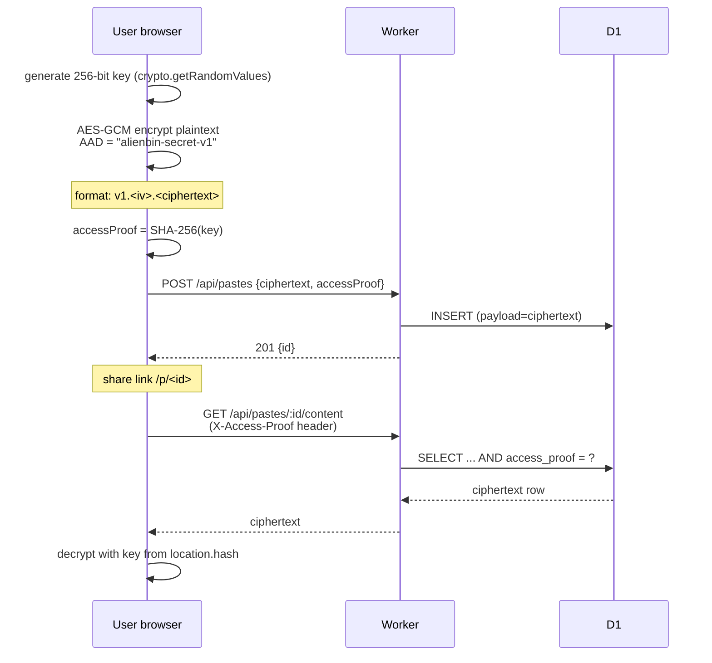

# Architecture

Alienbin v2 runs within Cloudflare's free tier: one Worker serves the static frontend and
JSON API, backed by D1. There is no VM, container, or external database service. Public
information pages at `/about`, `/privacy`, `/terms`, and `/security` ship in the same static
frontend.

## System overview


Key property: **static asset requests never invoke the Worker**, so they are free and do not
count against the Workers daily request quota. Only `/api/*` and `/raw/*` are routed to the
Worker first (`run_worker_first` in `wrangler.jsonc`).

## Module layout

```text
src/
├─ worker/            # Cloudflare Worker (Hono)
│  ├─ routes/         # health, paste endpoints
│  ├─ services/       # domain logic: paste-service, rate-limit, turnstile
│  ├─ repositories/   # D1 access, prepared statements only
│  ├─ middleware/     # security headers, rate limiting
│  ├─ validation/     # request validation (whitelists, byte-size checks)
│  └─ types/env.ts    # bindings + AppError
├─ web/               # Vite frontend, vanilla TypeScript
├─ shared/            # constants/types/expiration/clock shared by both sides
└─ cli/               # zero-dependency Node CLI
migrations/           # D1 SQL migrations
tests/                # unit / integration / security (vitest + workers pool)
```

## Secret paste flow (client-side encryption)

The server never sees plaintext **or** the encryption key. The key lives only in the URL
fragment, which browsers never send to servers.



## Expiration model

Each paste owns its `expires_at` (Unix seconds). Every read path filters on
`expires_at > now`, so expiry is enforced by query semantics, not by background jobs.
The hourly Cron Trigger only reclaims active storage (`DELETE ... WHERE expires_at <= now`)
and is never part of the access-control boundary. Cloudflare D1 Time Travel retains
restorable history for up to 7 days on the Free plan, so active-row deletion and backup
history retention are documented separately.

## Read-limited flow

Consumption uses one atomic statement per request. One-time pastes use `DELETE ... RETURNING`.
Limits of 3, 5, or 10 use a guarded counter update:

```sql
UPDATE pastes SET read_count = read_count + 1
WHERE id = ?1 AND burn_after_read = 1
  AND expires_at > ?2 AND access_proof IS ?3 AND read_count < max_reads
RETURNING id, payload, encrypted, language, expires_at, read_count, max_reads;
```

Concurrent consumers race on the SQL condition, so only the configured number receives the
payload. Plain GET requests cannot consume a limited paste because the content endpoint
refuses `burnAfterRead` rows. See ADR-004 for the one-time DELETE and counter rationale.
